# 오디오 리액티브 영상 제작

## 1. Keyframe 추출 사이트 사용

[framesync.xyz](https://www.framesync.xyz/)

1. 음원을 업로드한다.
2. WebUI에서 세팅한 fps 값을 입력한다.
3. 좌측의 Factory Presets에서 Basic Strength Schedule을 클릭 후 Primary Wave에서 .wav/.mp3를 클릭한다.
4. Primary Wave에서 파라미터를 조정한다.
    - **AMPLITUDE** : 절댓값이 클수록 keyframe의 최저값이 낮아짐 (최저점 = `SHIPT UP/DOWN` + `AMPLITUDE`)
        - Min, Max의 차이가 커질수록 audio에 민감하게 반응함
    - **SHIFT UP/DOWN** : Keyframe의 최고값
    - **BEND** : 값이 클수록 keyframe이 큰 쪽의 편차가 작아지고 작은 쪽의 피크만 남음
        - 음악이 크게 치고 들어갈 때 이미지를 확 변하게 하고 싶다면 크게 설정하면 좋음
    - Cosine, Sigmoid 등 다른 wave 함수를 쓰는 것보다 .wav/.mp3 파일에서 직접 추출하는게 가장 audio reactive하게 나옴
5. 출력된 string을 복사한다.
    
    
    

## 2. 수식 사용

[Audio keyframe generator](https://www.chigozie.co.uk/audio-keyframe-generator/)

1. 음악을 업로드한다.
    
    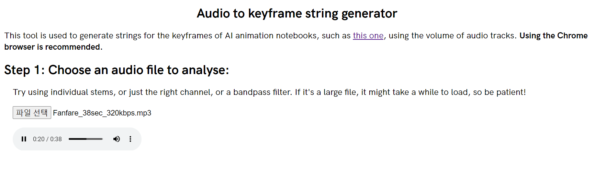
    
2. WebUI에서 세팅한 fps 값을 입력한다.
    
    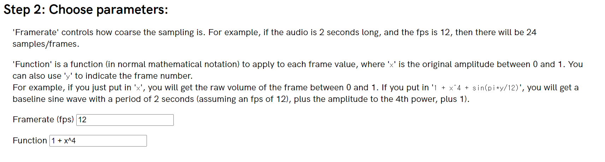
    
3. 음악의 진폭을 strength로 변환할 수식(Function)도 입력한다. Strength 값이 작을수록 새로운 이미지가 생성되므로, 진폭이 클 때 이미지 전환이 많이 되게 하고 싶다면 0~1의 범위에서 감소하는 함수를 입력해야 한다.
    - 진폭이 높을 때 급격히 변하게 하고 싶으면 오목 함수(concave function) 사용
    - 진폭이 낮을 때 급격히 변하게 하고 싶으면 볼록 함수(convex function) 사용
    - 같은 비율로 하고 싶으면 선형 함수(linear function) 사용
        
        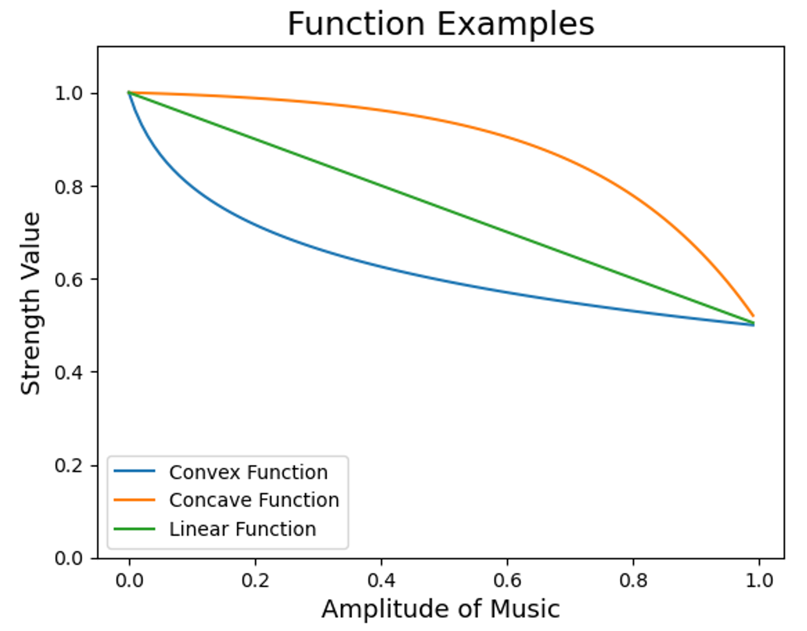
        
    
    <aside>
    💡 x=0(최소 진폭)일 때 strength가 a가 되고, x=h(최대 진폭) 일 때 strength가 b가 되는 함수 찾기
    
    </aside>
    
    1. Linear Function
        <!--
        ${y=({b-a \over h})x+a}$
       -->
        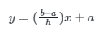
    3. Convex Function
        <!--
        $y={b-a\over \ln(ch+1)}\ln(cx+1)+a$
        -->
       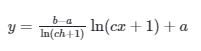
    5. Concave Function 
        <!--
        $y=(a+c)x - c\exp({\ln ({k_1-b \over c}) \over h} x)$
        -->
       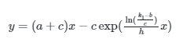
    - 예시
        
        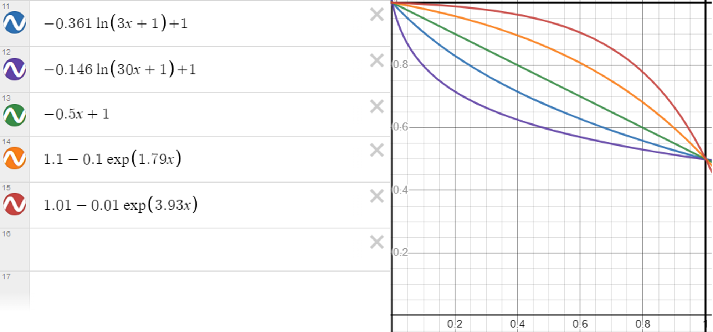
        
        - a=1, b=0.5, h=1
        
4. 출력된 string을 복사한다.
    
    
    

## (번외) Motion에 적용

### Keyframe 추출 사이트 사용

- Strength 방식과 동일하게 keyframe 추출 사이트를 사용하되, Primary Wave의 파라미터를 Motion Parameter의 범위에 맞게 설정한다.
- 예시 (3D Motion)
    - AMPLITUDE : -10 ~ 10 범위 내에서 Min, Max 값을 조절한다. (Translation 기준)
        - Min, Max의 차이가 커질수록 motion이 변하는 정도가 커져서 정신없어질 수 있음
        - -3 ~ 3 정도 범위 이내가 적당한 것 같음 (Translation 기준)
        - Rotation 기준 : -3 ~ 3 정도 범위 내에서 Min, Max 값을 조절해야함
        - -1.75 ~ 1.75 정도 범위 이내가 적당한 것 같음 (Rotation 기준)
    - (참고) 3D Motion
        - Translation X : left / right
        - Translation Y : up / down
        - Translation Z : zoom in / zoom out
        - Rotation X : rotate upward / rotate downward
        - Rotation Y : rotate up / rotate dowm
        - Rotation Z :  rotate clockwise / rotate counterclockwise
- **3D Translation Z**에 적용

  
    

### 수식 사용

- Motion에 cos, sin, exp 등의 함수를 사용하되, 함수에 사용되는 파라미터를 음악으로부터 찾는다.
- 예시 (음악에 맞는 cosine 함수의 주기 찾는 법)
    1. Audacity에서 음원 자르기 뿐만 아니라 스펙트럼을 통해 원하는 구간을 맞춰 바꿔 놓을 수 있다. 하나는 특정 움직임을 주고 싶은 음원이고, 다른 하나는 해당 음원을 스펙트럼으로 표현한 것이다.
        
        
        
        - 음원
        
        
        
        - 스펙트럼
        
    2. 해당 구간에 거의 일정한 주기로 반복되는 것을 볼 수 있는데, 해당 구간을 집어보면 약 0.26초가 나온다. 
        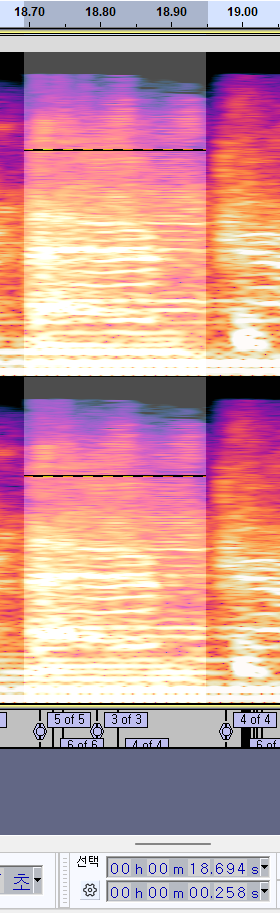
            
    3. 따라서 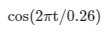를 Rotation_X나 Rotation_Y 에 집어넣으면 된다.
    4. 그런데, 진폭을 1이상 올리면 아래와 같이 Line이나 frame이 발생하는 현상이 있어서 진폭을 0.5 이하로 줄이되, 주기를 다소 늘리는 편을 추천한다. 

        - 
            
            <!--  -->
            
        - 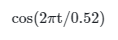
            
            <!--  -->
            
        - Final Movements 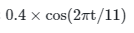

            
            
        
- 예시 (rotation 조정)
    - rotation_x는 위/아래로 회전하는 효과를 주고, rotation_y는 좌/우를 회전하는 효과를 준다. 이 때, 밑바닥에서 올라가듯이 날아다니는 느낌을 주고 싶다면  rotation_x와 rotation_y를 동시에 sin 함수를 사용하여 주기를 300 이상을 넣어보자.  
    - rotation_x: 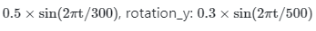
        
        
