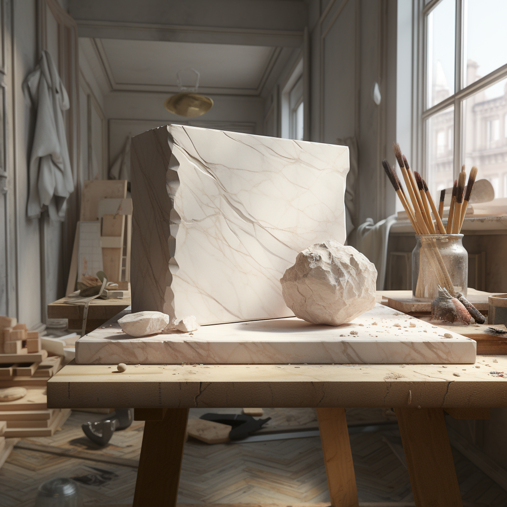
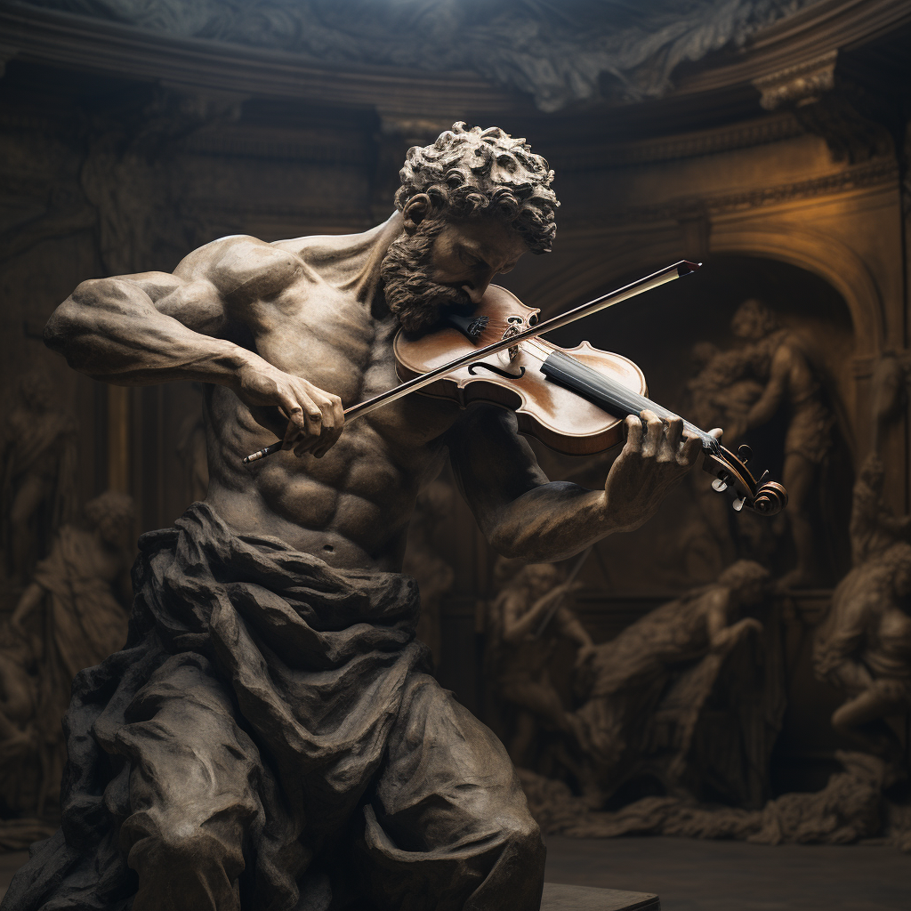

# Deforum - 주요 Paramemters
<br>

## Schedule Keyframing

- Schedule 파라미터들은 `frame1:(value1), frame2:(value2), …` 형식으로 정의함
- 프레임 간의 값은 다음 새 값이 나올 때까지 동일하게 유지되지 않고 다음 값을 향해 선형으로 변화함
- ex) `0:(0), 5:(5)` → `0:(0), 1:(1), 2:(2), 3(3), 4:(4), 5:(5)`

### 팁

- 프레임 간의 스케쥴 값을 유지하고 싶다면 `frame1:(value1), (frame2)-1: (value1), frame2:(value2), …` 와 같이 넣어주면 됨
- ex) `0:(0), 4:(0), 5:(5)` → `0:(0), 1:(0), 2:(0), 3:(0), 4:(0), 5:(5)`

## Animation Mode
<details>
<summary><b>Web UI Screenshot</b></summary>
    

</details>


### 설명

- 2D: 2D animation 모드
    - `border, angle, zoom, translation_x, translation_y, noise_schedule, contrast_schedule, color_coherence, diffusion_cadence, save_depth_maps` 외에 다른 animation 파라미터들은 적용되지 않음
- 3D: 3D animation 모드
    - `border, translation_z, translation_x, translation_y, rotation_3d_x, rotation_3d_y, rotation_3d_z, noise_schedule, contrast_schedule, color_coherence, diffusion_cadence, 3D depth warping, midas_weight, fov, padding_mode, sampling_mode, save_depth_map` 외에 다른 animation 파라미터들은 적용되지 않음
- Video Input: video to video 모드.
    - `max_frames, fps, Motion parameters, resume_from_timestring` 은 입력이 되어도 적용되지 않음
- Interpolation
    - 모든 motion, coherence 파라미터들을 무시하고 일정 프레임 번호가 나열된 프롬프트 간의 프레임을 보간(interpolate)함

### 예시

| 2D animation mode | 3D animation mode|
| :----: | :----: |
|  | |
<!--


2D animation mode


3D animation mode
-->
<br>

## Cadence
<details>
<summary><b>Web UI Screenshot</b></summary>
    

</details>


### 설명

- 프레임 간의 부드러운 움직임을 위해 프레임 사이의 간격을 interpolation하며 더 깨끗한 애니메이션과 더 적은 깜박임을 제공함
- ex)
    - Cadence 5 -> diffuse 1 frame, draw 4 non-diffused -> output 5 total
    - Cadence 1 -> diffuse 1 frame, draw 0 non-diffused -> output 1 total
    - Cadence 8 -> diffuse 1 frame, draw 7 non-diffused -> output 8 total
- 값이 1보다 크면 프레임 생성을 건너뛰므로 생성 시간이 줄어듦

### 예시

| cadence = 1 | cadence = 2|
| :----: | :----: |
| .gif) |.gif) |

<!--
.gif)

cadence=1

.gif)

cadence=2
-->
### 팁

- Cadence가 3보다 크면 영상의 변화가 지나치게 느려짐(?)
- 클래식과 같이 느린 음악에는 cadence를 높이는게 어울리기도 함
<br>

## Border mode
<details>
<summary><b>Web UI Screenshot</b></summary>
    

</details>

### 설명

- 이미지를 벗어난 pixel에 대해서 어떻게 표현할지 정하는 모드
- replicate: 맨 끝 자리에 있는 픽셀을 반복한다. 만약 카메라 움직임이 빠르다면, 비어져 있는 공간을 채우기 위해 그 전 픽셀들의 색상을 복사하므로, 해당 부분은 선처럼 나타남
- wrap: 이미지 반대쪽에서 픽셀을 끌어옴

### 예시
|| replicate| wrap|
| :----: | :----: |:----: |
|2D zoom out <br> (zoom=0.9)|  ||
|3D zoom out <br> (translation Z = -5)|  | |

<!--


2D zoom out(0.9) - replicate


2D zoom out(0.9) - wrap


3D zoom out(-5) - replicate


3D zoom out(-5) - wrap
-->
### 팁

- zoom in에서는 차이가 보이지 않고 zoom out시에만 적용된다.
<br>

## Guided Images
<details>
<summary><b>Web UI Screenshot</b></summary>
    

</details>


### 설명

- 영상의 중간에 인풋 이미지를 주어 해당 이미지에 비슷하게 영상을 생성할 수 있는 기능

### 예시
<details>
<summary>Guided images / Prompts</summary>
    
| 1. white marble block is on the table| 2. Michelangelo constructs a sculpture|
| :----: | :----: |
|  | |
| 3. A white statue is playing the violin| 4. The Colosseum is covered in snow|
| || 
    
</details>
    
1. fps : prompt 입력 시 fps의 범위에 따라 guided image 반영률이 달라짐
    | fps = 30 | fps = 10 |
    | :----: | :----: |
    | | |
    | marble block → sculpture → statue → colosseum 순으로 모두 나타나있음| marble block → colosseum 만 표현됨|


2. Guided image strength : guided image의 strength에 따라 생성된 영상에서 guided image를 유지하는 정도가 달라짐
    | strength = 0.8 | strength = 0.1 |
    | :----: | :----: |
    | ||
    - Global strength / Prompts
        - Global Strength : 0.5
        - Prompt: Michelangelo constructs a sculpture

3. Global strength : guided image에서 prompt 반영률이 달라짐
   | strength = 0.8 | strength = 0.1 |
    | :----: | :----: |
    | ||
    - Guided image strength / Prompts
        - Guided image strength: 0.5
        - Prompt: Michelangelo constructs a sculpture


### 팁

- guided images와 prompt 입력 시 fps(frame per second)를 낮추는 경우 guided images와 prompt가 frame 생성 속도에 맞추지 못해 제대로 반영되지 않음
- Guided image strength를 높게 할 경우, guided image를 유지하며 이미지가 생성됨
    - Guided image strength를 낮게 할 경우, guided image가 덜 유지됨
- Global strength를 높게 할 경우, prompt보다 guided image를 유지하며 이미지가 생성됨
    - Global strength를 낮게 할 경우, guided image보다 prompt에 맞춰 이미지가 생성됨
- Guided image strength를 낮추고 Global strength를 높게 할 경우, guided images 준 직후에만 이미지를 따라가고 그 이후에는 prompt를 다시 따라가서 영상이 부자연스러워 보임
- Guided image를 최대한 유지하고 싶은 경우, Guided image strength를 높이는 것도 중요하지만 Global strength를 높이는 것이 Guided image를 유지하는데 더 효과적임
    - Global strength(= prompt 반영률)이 Guided image strength보다 deforum 영상 생성에 더 영향을 많이 주는 parameter인 것 같음
- Error: 'images do not match'. Before reporting, please check your schedules/ init values. Full error message is in your terminal/ cli.
    - 원인은 작품의 사이즈가 8의 배수가 아니면 발생한다.
<br>

## Strength
<details>
<summary><b>Web UI Screenshot</b></summary>
    

</details>


### 설명

- 현재 프레임의 diffusion 과정에 사용할 이전 프레임의 비율 (0~1)
- 0: 아예 새로운 프레임을 노이즈로부터 새로 생성함
- 1: 이전 프레임을 그대로 사용함

### 예시
| strength = 0 | strength = 0.5|
| :----: | :----: |
|  ||
| strength = 0.7 | strength = 0.9|
|  ||
- Prompt : a light bulb is put on a table near a gray wall, in the style of light cyan and gold, use of screen tones, youthful energy, iso 200, organic material, clean-lined, award-winning
    <!--
    
    
    strength = 0
    
    
    
    strength = 0.5
    
    
    
    strength = 0.7
    
    
    
    strength = 0.9
    -->
### 팁

- 값이 클 수록 이전 프레임 재활용 비율이 증가하므로 영상 생성이 짧게 걸림
- 음악의 진폭에 반비례하게 넣으면 음악에 반응하는 영상 생성 가능
- frame별로 strength에 적절한 변화를 주면 다음과 같은 효과를 볼 수 있다.
1. 높은 값에서 → 낮은 값으로: 화면이 전환되는 느낌을 줄 수 있다.
    
    
    
    - 음악에 생동감을 부여할 수 있다. 이런 효과는 EDM에서 잘 써먹을 수 있는데, EDM에서 킥 사운드가 두드러지는 음악을 사용할 때 효과가 두드러진다. 예시 keyframes
    - 사용예시        
        ```
        {0: 0.7, 299: 0.7, 300: 0.3, 320: 0.3, 321: 0.7}
        ```
    
    - audio reactive에 적절히 활용하면 [작품에 효과적으로 생동감을 부여할 수 있다.](https://www.youtube.com/shorts/a3xuiGNyWYs)
2. 낮은 값에서 → 높은 값으로: 해당 장면에 집중하는 효과를 줄 수 있다.

    

3. strength와 motion에 함께 효과를 준 경우.
    - strength에 변화를 주면서 동시에 motion(zoom이나 상하좌우로 움직이는 카메라 모션)에도 변화를 주게 된다면, 착시효과처럼 관객이 부자연스러움을 덜 느끼면서 전환효과를 줄 수 있다.
    - 예시: [https://youtu.be/If77St4tbXU?t=24](https://youtu.be/If77St4tbXU?t=24)
<br>

## CFG
<details>
<summary><b>Web UI Screenshot</b></summary>
    

</details>


### 설명

- Classifier-free-guidance의 줄임말로, 이미 생성 시 텍스트 프롬프트를 얼마나 따르게 할지에 대한 설정값
- CFG가 높을수록 생성된 이미지가 프롬프트를 따라가게 되지만 지나치게 높을 경우 인공물들이 많이 생기게 되므로 7 정도가 가장 자연스러움

### 예시
| CFG = 7| CFG = 20|
| :----: | :----: |
|  ||
- prompt
    
    ```
    {"0": "an apple", "24": "a banana", "48": "a coconut", "72": "a durian", "96": "an apple, a banana, a coconut, a durian"}
    ```
    <!--
    
    
    CFG=7
    
    
    
    CFG=20
    -->

### 팁

- CFG가 낮을수록 프롬프트를 따르지 않기에 CFG가 낮아야 creative results가 생성된다고 생각할 수 있지만 CFG가 높으면 artifacts가 많이 생성되면서 어느 관점에서는 creative한 것처럼 보일 수 있음
<br>

## Subseed, Step, Sampler, Checkpoint
<details>
<summary><b>Web UI Screenshot</b></summary>
    

</details>


- 해당 파라미터들의 Schedule을 지정할 수 있는 부분

<br>

## Motion
<details>
<summary><b>Web UI Screenshot</b></summary>
    

</details>


### 설명

- 영상이 이동 방식(카메라 무브먼트)를 조절할 수 있는 파라미터


### 팁

- sin, exp와 같은 수식도 사용 가능함
- 카메라 무빙과 회전을 함께 주게 되면, 입체감있게 도는 효과를 줄 수 있다.
    
    
    
<br>

## Noise
<details>
<summary><b>Web UI Screenshot</b></summary>
    

</details>


### 설명

- Diffusion의 다양성을 위해 프레임당 추가할 노이즈의 양을 제어하는 파라미터
- uniform : 선명한 이미지를 얻고 싶을 때
    - Noise schedule : ```0: (0.065)```
    - Enable noise multiplier scheduling : 활성화
- perlin : 지속성 있는 이미지를 얻고 싶을 때 (선명함은 사라짐)
    - Noise schedule : ```0: (0.065)```
    - perlin octaves : 4
    - perlin persistence : 0.5
    - Enable noise multiplier scheduling : 활성화

