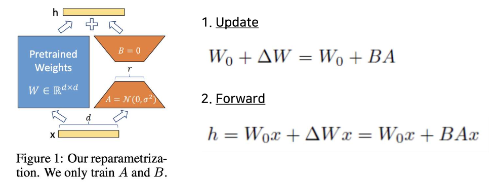
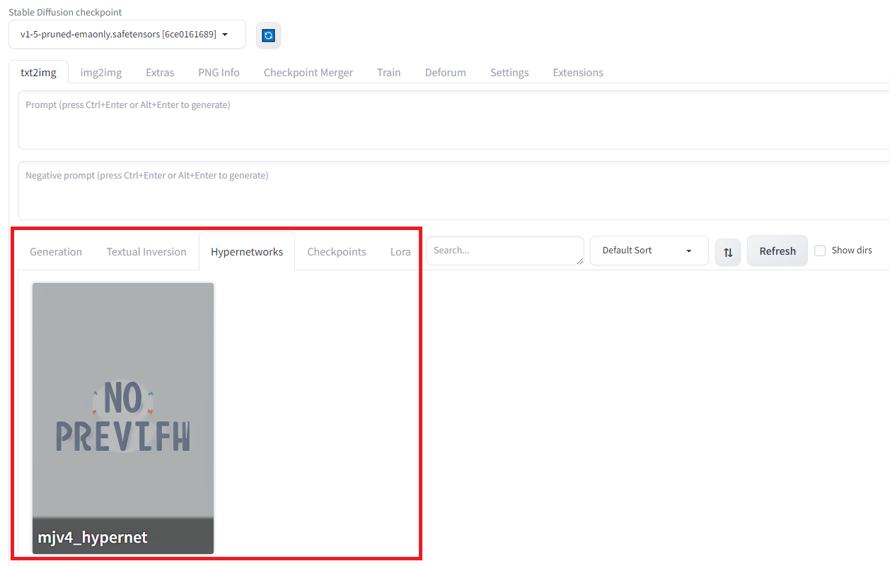
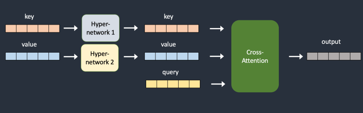

# Stable Diffusion 세팅
 

## Checkpoint

<b>Web UI Screenshot</b>

    

### 설명

- 특정 스타일의 이미지를 생성하기 위한 pre-trained Stable Diffusion weights
- 적용 방법 : `stable-diffusion-webui/models/Stable-diffusion` 폴더에 원하는 모델의 `.safetensors` 파일을 저장

### 예시
<!--

v1-5-pruned-emaonly.safetensors (default)

stable-diffusion-xl-refiner-1.0

dreamshaper_8.safetensors
-->

| v1-5-pruned-emaonly.safetensors   (default) | stable-diffusion-xl-refiner-1.0 | dreamshaper_8.safetensors |
| :----: | :----: | :----: |
|  |  |  |
- **Prompt** : a man standing on the beach looking at the sea

### 팁

- webui 기본 checkpoint인 `v1-5-pruned-emaonly.safetensors` 로 영상을 생성할 경우 영상 퀄리티가 좋지 않음
- 전시회 작품은 SDXL, Dreamshaper을 주로 사용함

 

## LoRA

<b>Web UI Screenshot</b>

    

### 설명

- 기존 pre-trained weight는 고정하고, 몇 개의 dense layer만 rank decomposition matrices를 최적화하는 방식으로 학습시키는 모델
- 사용자 개인의 경험을 반영하여 **concept을 유지**한 채 이미지를 생성할 수 있음
   
- 적용 방법 :
    - `stable-diffusion-webui/models/Lora` 폴더에 원하는 모델의 `.safetensors` 파일을 저장
    - Prompts를 적을 때 ` <lora:filename:multiplier>` 형식으로 입력하고 trigger words가 있는 경우 함께 입력함
    - 예시 : `{"0": " a peaceful town, <lora:detail_tweaker:1>, trigger_word "}`

### 예시

| default | detail tweaker LoRA|
| :----: | :----:|
|  |  |
- **Prompt** : a woman shaking her two hands, octane render, highly detailed

### 팁

- Stable diffusion 모델은 기존에 학습된 이미지를 사용하여 그림을 그리므로 custom 이미지(ex- 우리집 강아지의 이미지)를 반영하지 못하지만 LoRA를 사용하면 custom 이미지를 받아 학습시킬 수 있어, concept customization된 그림을 그릴 수 있음
- Concept이 잘 유지되므로, 특정 그림체(ex. pixel art)를 생성하고 싶을 경우 trigger word(ex. (pixel:0.8))를 이용해 특정 그림체가 반영된 그림을 그릴 수 있음
    - (pixel:0.8) 와 같이 특정 그림체의 반영 정도를 정할 수 있음     

 

## Hypernetwork

<b>Web UI Screenshot</b>

    

### 설명

- 모델의 cross-attention 레이어 중간에 들어감으로써 작은 네트워크의 weight로 큰 네트워크의 weight 조절을 이끌어내는 fine-tuning 기법
- checkpoint 학습에 비해 파일 크기가 작고 훈련 속도가 빠르지만 LoRA 보다는 효과가 떨어짐
   
- 적용 방법 :
    - `stable-diffusion-webui/models/hypernetworks` 폴더에 원하는 모델의 `.pt` 파일을 저장
    - Prompts를 적을 때 ` <hypernet:filename:multiplier>` 형식으로 입력함
    - 예시 : `{"0": "a portrait of woman with blond hair, <hyperenet:mjv4_hypernet:1>"}`
### 예시

| default | MJV4 hypernetwork|
| :----: | :----:|
|  |  |
- **Prompt** :  a woman with blond hair, octane render, highly detailed

 

## Textual Inversion (Embedding)

<b>Web UI Screenshot</b>

    

### 설명

- 텍스트 인코더(text encoder)에 새로운 임베딩(단어)을 생성하여 개인 사물이나 예술적 스타일과 같은 특정 개념을 생성하는 방법
- 모델을 직접 조정하는 것이 아니므로, LoRA나 Hypernetwork보다는 효과가 작음
     
- 적용 방법 :
    - `stable-diffusion-webui/embeddings` 폴더에 원하는 모델의 `.pt` 파일을 저장
    - Prompts에 학습에 사용한 단어를 입력함
    - Negatvie prompt의 경우 Prompts negative에 `(filename:multiplier)` 형식으로 입력함
    - 예시 : `(easynegative:0.75)`
 
### 예시

| default | easynegative embedding|
| :----: | :----:|
|  |  |
- **Prompt** : a woman shaking her two hands, octane render, highly detailed

 

## Sampler

<b>Web UI Screenshot</b>

    

### 설명

- Diffusion 과정의 각 단계에서 새로운 샘플 이미지를 생성할 때 노이즈를 제거하는 방법

- [Complete guide to samplers in Stable Diffusion](https://www.felixsanz.dev/articles/complete-guide-to-samplers-in-stable-diffusion)

- [ArtStation - Stable Diffusion - Samplers](https://www.artstation.com/blogs/kaddoura/pBPo/stable-diffusion-samplers)

### 예시

<!--

Euler a : 3min 41s

LMS : 3min 44s

DPM++ 2M Karras: 3min 6s
-->

| Euler a | LMS | DPM++ 2M Karras |
| :----: | :----: | :----: |
|  |  |  |
- **Prompt** : the old japanese street side on an avenue with trees, in the style of concept art, lively tavern scenes, muted palette, bloomcore, cherry blossoms, anime-inspired, religious building

### 팁

- Prompt 별로 잘 그려내는 sampler가 다름
- 모든 Prompt에서 노이즈처럼 그려내는 sampler들도 있음
    - LMS, DPM++ 2M SDE, DPM++ 2M SDE Heun, PLMS
- Euler, Euler a가 눈에 보기에 가장 자연스럽고, Kaiber 영상과 가장 유사함
- 전시회 작품은 Euler a를 사용함

 

## Steps

<b>Web UI Screenshot</b>

    

### 설명

- Diffusion 과정의 한 단계에서 주어진 프롬프트 도달까지 반복하는 샘플링 횟수
- 값이 크면 생성이 오래 걸리는 대신 그만큼 생성되는 이미지의 퀄리티가 올라감
- 값이 작으면 생성이 빠른 대신 이미지의 퀄리티가 떨어짐
- 값이 어느 정도 이상보다 더 커지면 더 이상 이미지의 퀄리티가 증가하지 않음

### 예시

<!--

step = 10

step = 20

step = 30
-->
| step = 10 | step = 20 | step = 30 |
| :----: | :----: | :----: |
|  |  |  |
- **Prompt** : a light bulb is put on a table near a gray wall, in the style of light cyan and gold, use of screen tones, youthful energy, iso 200, organic material, clean-lined, award-winning

### 팁

- Sampler의 종류에 따라 필요한 steps 수가 달라짐
- 평균적으로 25이상이면 이미지 퀄리티가 크게 달라지지 않음
- 전시회 작품은 주로 25을 사용함

 

## Seed

<b>Web UI Screenshot</b>

    

### 설명

- 생성 과정에 걸쳐 이미지를 일관되게 유지할 수 있는 기능(숫자)
- 다른 사용자가 영상을 생성하더라도 seed를 비롯한 타 조건이 동일하면 동일한 결과물 생성이 가능함
- Behavior 예시 :
    1. **Iter** = incremental change (ex 77, 78, 79 ,80, 81, 82, 83…)
    2. **Fixed** = no change in seed (ex 33, 33, 33, 33, 33, 33…)
    3. **Random** = randomized seed (ex 472, 12, 927812, 8001, 724…)

### 팁

- Seed behavior 중에서 fixed를 사용할 경우 시드가 동일해지면서 노이즈 제거가 발생하지 않아 시간이 지나면서 이미지가 노이지로 뒤덮이게 되거나 이미지가 flat하게 보이는 등의 문제가 발생하므로 피하는 것이 좋음
