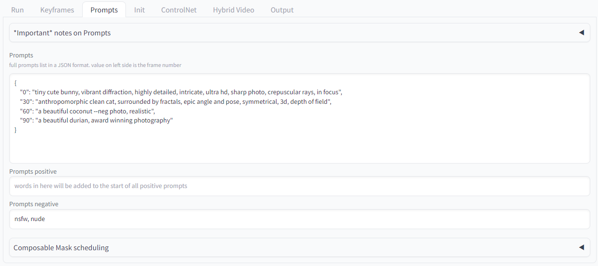

# [JupyterBook] Prompt

## Prompt Engineering



### General Tips

1. Negative Prompts
    - **worst quality, normal quality, low quality, low res, blurry, text, watermark, logo, banner, extra digits, cropped, jpeg artifacts, signature, username, error, sketch ,duplicate, ugly, monochrome, horror, geometry, mutation, disgusting**  : 전반적인 이미지 품질이 올라감
    - **bad anatomy, bad hands, three hands, three legs, bad arms, missing legs, missing arms, poorly drawn face, bad face, fused face, cloned face, worst face, three crus, extra crus, fused crus, worst feet, three feet, fused feet, fused thigh, three thigh, fused thigh, extra thigh, worst thigh, missing fingers, extra fingers, ugly fingers, long fingers, horn, realistic photo, extra eyes, huge eyes, 2girl, amputation, disconnected limbs** : 애니메이션 캐릭터를 더 잘 그림
    - **bad anatomy, bad hands, three hands, three legs, bad arms, missing legs, missing arms, poorly drawn face, bad face, fused face, cloned face, worst face, three crus, extra crus, fused crus, worst feet, three feet, fused feet, fused thigh, three thigh, fused thigh, extra thigh, worst thigh, missing fingers, extra fingers, ugly fingers, long fingers, horn, extra eyes, huge eyes, 2girl, amputation, disconnected limbs, cartoon, cg, 3d, unreal, animate** : 사실적인 캐릭터 묘사에 좋음
    - **nsfw, nude, censored** : 성인 및 유해 컨텐츠 생성 제한
    - **bad anatomy** : 부자연스러운 신체표현이 개선됨
      
        

          One white man is dancing, detailed, realistic
        
        

          One white man is dancing, detailed, realistic, —neg bad arms, bad anatomy, bad fingers
        
    - **bad face, people** : positive에 사람을 넣을 경우 사람 뒷모습이 주로 나옴
    - **bad arms** : positive에 사람을 넣을 경우 상반신이 주로 나옴
    - **white space, frame** : 그림 테두리에 빈공간이 생기는 현상이 완화됨
2. Key Prompts
    - **neon, sf, mecha funk, star**
3. View/Composition 관련 Prompt
    - **Centered Compositio**n : 중앙 배치
    - **Birds-eye View** : 공중에서 내려다 보는 시야
    - **Up View** : 아래에서 올려다 보는 시야
    - **Rule of Thirds** : 조화롭고 균형있는 배치
    - **Symmetrical** : 좌우 대칭
4. Layout 관련 Prompt
    - in the style of **grid composition**: 이미지가 격자 모양으로 배치되지만 이미지 배경에 격자무늬가 생김
        
        
        
    - in the style of **tile composition**: 이미지 배경의 격자무늬는 사라지지만 이미지 배치가 격자가 아닌 자유로운 배치로 배치됨
        
        
        
    - in the style of **grid layout**: 이미지가 격자 모양으로 배치되고, 격자무늬도 완화됨
        
        
        
5. 주로 예술작품을 prompt에 작성하게 되면 액자 프레임이 생성되는 경향이 있음
    - 특히 zoom out 하게 되면 테두리에 줄이 생기는 현상이 좀 더 빈번하게 생기는 듯함
6. 특정 화가를 넣으면 해당 화가의 화풍으로 그림
    - ex) Starry Night by Wassily Kandinsky
7. Prompt가 너무 길어지면 오히려 반영을 잘 못함
8. CLIP scale 값을 내리면 prompt를 매우 잘 반영함

### Deforum 관련 Tips

1. 영상 색감이 첫 이미지 색감을 따라가는 경향이 있음
    
    
    
    
    
2. Camera movement를 한 방향으로 움직일 때 사람이나 물체를 많이 넣으면 어색함
3. Positive prompt - Prompt - Negative Prompt 순으로 반영이 잘되고, 그 안에서도 앞에 있을 수록 반영이 더 잘됨
    - 객체, 스타일 순으로 넣는 것이 좋음
4. 사람과 비행기 등 구체적인 묘사가 필요한 객체는 어색한 경우가 많으므로 최대한 배제하는 것이 좋음

### Prompt 구상 방법

- **현욱**
    - HTML 구조로 생성해보기
        
        ```
        <object> a woman standing inside a field of flowers 
        <large t> Draw the portrait of the most beautiful Asian girl. She has long black hair and a radiant smile. Her eyes are large and bright, and her skin is clear and smooth. 
        <small t> nikon d850, 32k uhd, sandara tang, colorful pop, miwa komatsu, synchromism, close up, miwa komatsu, flutter
        ```
        
    - 생성형 모델에서 프롬프트는 장황한 설명보다는 문법구조를 갖춘 형태가 LLM과 대화하기 더 수월함
    - ex) 미드저니에서도 프롬프트를 추천할 때 in the style of 전후를 기준으로, 객체와 스타일을 나눔
- **지윤**
    - ChatGPT의 *[AIPRM Prompt "Stable Diffusion Prompt Generator"](https://www.aiprm.com/prompts/generative/stable-diffusion/1785519285175848960/)* 에 키워드를 넣고 나온 prompt를 실험해보고 수정함
        
        
        
        keyword : mythical flame
        
- **광수**
    1. chatGPT 사용할 때
        - 원하는 이미지를 구상하면서 이미지에 넣을 object들을 리스트업한다.
        - 리스트업한 object를 정리해서 chatGPT에게 물어본다.
        - 해당 prompt를 stable diffusion에 입력하고, 생성되는 이미지를 보면서 조금씩 수정한다.
        - 생성된 이미지를 deforum에 입력하고, 위와 비슷한 방법으로 프롬프트를 작성하면서 조금씩 수정한다.
    2. playground를 사용해서 기존의 이미지를 활용하는 법
        - [playground.ai](https://playgroundai.com/)에서 prompt를 검색하면서 원하는 이미지와 비슷한 이미지를 고른다.
        - 원하는 이미지가 없으면 1.의 방법을 써서 새로 만든다.
        - 원하는 이미지가 있으면 이미지와 거기에 사용되는 prompt를 복사해서 가져다 쓴다.
        - 비디오를 생성하면서 원하는 장면이 나올때까지 프롬프트를 조금씩 고쳐가면서 제작한다.
    - object 선정 시 tip
        - 최대한 복잡한 구조를 가지면서 디테일이 중요한 개체(사람, 비행기)는 그리지 않는 것이 좋고, 단순한 개체(풍선 같은)를 그리는 것이 편하다.
        - [예시](https://www.youtube.com/watch?v=l8xCenInPY0)로 시작 이미지가 사람 이미지 이지만, 대신에 간단하게 생긴 물체인 풍선을 자주 등장시키고, zoom-out으로 부자연스러운 장면을 최소화시킨 작품을 만들었다.
- **민지**
    - Huggingface에서 다양한 모델들로 테스트 해볼 수 있는 공간이 있다.
    - Style 선택부터 prompt 생성까지 해볼 수 있기 때문에 아이디어 없다면 아래 모델들로부터 먼저 테스트 해보는 것도 좋다.
        
        ](media-prompt-engineering/Untitled%205.png)
        
        [https://huggingface.co/spaces/doevent/Stable-Diffusion-prompt-generator](https://huggingface.co/spaces/doevent/Stable-Diffusion-prompt-generator)
        
        ](media-prompt-engineering/Untitled%206.png)
        
        [https://huggingface.co/spaces/mrbeliever/AI-Image-Prompt-Generator](https://huggingface.co/spaces/mrbeliever/AI-Image-Prompt-Generator)
        
    - 혹은 이미지를 생성한 다음 midjourney나 inpainting에서 다시 재처리하여 사용하는 방법도 있다.
        
        ](media-prompt-engineering/Untitled%207.png)
        
        [https://huggingface.co/spaces/CoolSnow/stable-diffusion-models](https://huggingface.co/spaces/CoolSnow/stable-diffusion-models)
        
- **지현**
    - promptoMANIA에서 원하는 스타일의 프롬프트를 찾은 후 테스트해본 후 최적화
        
        
        
        [promptoMANIA: AI art community with prompt generator](https://promptomania.com/)
        
    - 노래의 가사를 참고하여 프롬프트로 사용
    - Playground의 SD1.5, SDXL 모델과 다양한 checkpoint를 빠르게 테스트하여 canvas에 프레임마다 원하는 화풍을 이미지를 리스트업, 마음에 드는 화풍의 프롬프트만 참고하여 사용
        
        
        
        [Free AI image generator: Art, Social Media, Marketing | Playground](https://playgroundai.com/)
        
- **해린**
    - chat GPT deforum generator template을 활용함
        
        [](https://github.com/hashmil/stablediffusion-midjourney-prompts/blob/main/deforum-story-prompt-gen.txt)
        
    - 주제를 구상한 뒤 GPT에게 제시하고 답변으로 받은 prompt를 수정한다.
    - GPT가 생성한 prompt에서 너무 추상적은 단어나 표현은 삭제하고 직관적인 표현들만 남긴다.
    - 원하는 style은 강조하거나 prompt의 앞쪽에 배치하고 prompt를 작성할 때는 문장 보다는 단어의 배열을 배치하는 형식으로 수정하였다.
    - 이후 실험을 통해 원하는 느낌으로 수정해나간다.
- **선민**
    - Midjourney에서 원하는 느낌의 이미지를 생성 후, 생성된 이미지를 다시 Midjourney에서 describe 기능을 이용해 표현하도록 만듬
    - 생성된 describe prompt 4개 중 가장 이미지와 어울리는 prompt를 고르고, 3줄이상 넘어갈 경우 2줄 이내로 줄임
        
        
