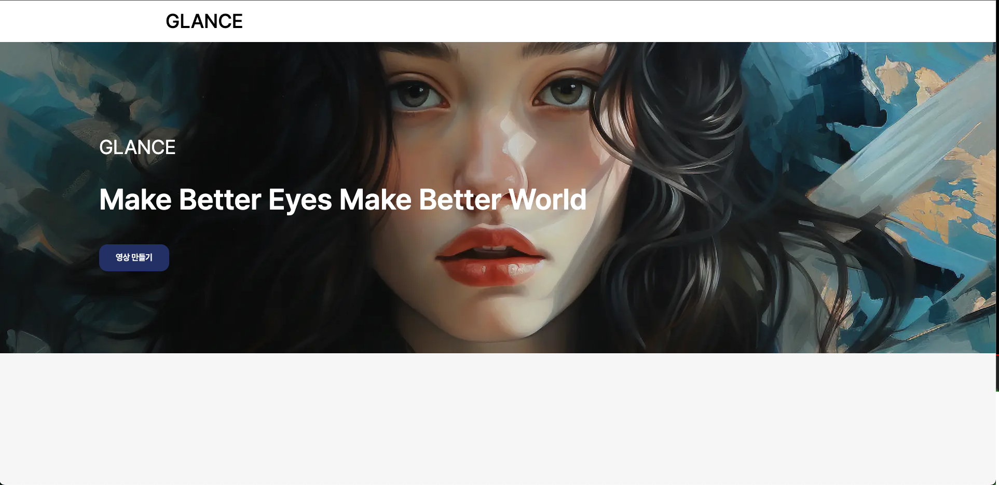

# 웹 기반 AI 영상 생성 데모 개발

## 코드 설치 및 실행

github 주소에 들어가서 안내에 따라 각각 설치하시면 됩니다.

## [backend](https://github.com/DCV1/unimaker-backend)
이 코드는 AUTOMATIC1111/stable-diffusion-webui 1.6.0 버전을 기준으로 작성되었습니다.

이 코드는 unimaker의 backend api 구현을 위해서 deforum 코드에서 api 부분만 수정한 코드임을 참고바랍니다.

## [frontend]()
터미널에서 명령어

- yarn
- yarn dev

각각 한번씩 해주시면 실행됩니다.

## 사이트 이용방법

[localhost:3000](http://localhost:3000) 으로 들어가면 다음과 같은 화면이 나옵니다.

1. 영상 만들기 클릭

1. 소스 음악 하단의 ‘선택→’을 클릭.

참고) 재생 버튼을 누르면 음악이 재생됩니다.

1. 이미지를 선택하고 상단에 ‘이 이미지 선택 →’ 버튼을 누릅니다.
- 제작하고 싶은 뮤직비디오의 분위기를 정하는 이미지입니다. 영상 전체에 영향을 끼칠 수 있으니 참고바랍니다.

1.  각 항목별로 옵션을 선택하면, 뮤직 비디오 만들기 버튼이 활성화 됩니다. 해당 버튼을 클릭하면 영상이 제작되기 시작합니다. 

